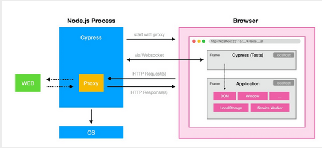
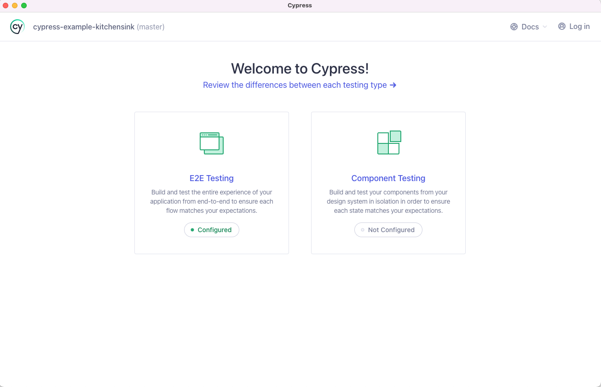

# Ponderada-Semana-5-ES9

## 1. O que é o Cypress e para que serve?

O Cypress é uma ferramenta de teste de front-end de código aberto que permite escrever, executar e depurar testes de forma fácil e eficiente. Ele é projetado especificamente para testar aplicativos da web modernos.

Logo se tornando possivel utiliza-lo em frameworks de SPA como, React, Angular, Vue e outros que se denominam como SPA, além de poder ser utilizado em aplicações que não utilizam esse padrão.

## 2. Vantagens e desvantagens do Cypress em relação a outras ferramentas de teste.

### Vantagens:
- Interface de usuário amigável e fácil de aprender.
- Execução rápida de testes.
- Integração nativa com Mocha e Chai.
- Possui ferramentas de depuração poderosas.
- Suporte a seletores de elementos inteligentes.
- Capaz de simular eventos e interações de forma realista.
- Funciona com multi frameworks.

### Desvantagens:
- Limitado a aplicativos da web (não suporta testes em aplicativos móveis ou desktop).
- Suporte limitado para testes em navegadores que não são baseados em  Chromium, por exemplo o Safari que não se comporta tão bem como o Chrome nesse quesito. 

**O Cypress suporta apenas o Firefox e navegadores baseados em Chromium, como o Google Chrome e o Microsoft Edge. O Cypress tem suporte experimental para o WebKit, o motor de navegador usado pelo Safari. O Cypress não suporta o Edge legado ou o Internet Explorer.**

- Não é possível testar aplicações que requerem autenticação de duas etapas diretamente, pelo menos nativamente, sendo necessário a utilização de alguns plugins e ferra,entas externas.

## 3. Arquitetura do Cypress

O Cypress é baseado em uma arquitetura de dois componentes: o Cypress Dashboard e o Cypress Test Runner. O Dashboard é opcional e permite gerenciar e monitorar testes em execução, enquanto o Test Runner é a interface onde os testes são escritos, executados e depurados.

### Arquitetura de como ele interage com o navegador

Podemos analisar que o Node interage diretamente com o Browser com chamadas HTTP e também utilizando webSocket para realizar algumas comunicações além de ser utilizado o próprio DOM para mexer e manipular certos elementos na interface.

### Arquivos que são gerados para configuração

- arquivo de configuração do Cypress **(cypress.config.ts)**
- subdiretorio para serem realizados os testes, onde ja começam com alguns exemplos **(cypress)**

## 4. Seletores de elementos no Cypress

No Cypress, você pode selecionar elementos da página usando seletores jQuery, XPath ou atributos HTML. Além disso, o Cypress fornece seletores especiais como `cy.get()`, `cy.contains()`, etc., para facilitar a seleção de elementos.

Tem o caso onde nada impede de o próprio desenvolvedor criar o seu seletor de elemento, caso sejá uma situação especifica ou até mesmo necessária para o contexto da aplicação de teste.

## 5. Comandos e asserções no Cypress

O Cypress fornece muitos comandos para serem utilizados para validar certos valores e estados dos componentes na interface, sendo um conhecido por nós na aula o `namespace.cy`, para conseguir pegar os valores do title e visitar certas páginas da aplicação.

O Cypress fornece uma ampla variedade de comandos e asserções para interagir com elementos da página e verificar o estado do aplicativo durante a execução dos testes. Alguns exemplos incluem `cy.click()`, `cy.type()`, `cy.get()`, `cy.should()`, etc.

Tem o caso onde nada impede de o próprio desenvolvedor criar o seu asserções, caso sejá uma situação especifica ou até mesmo necessária para o contexto da aplicação de teste, sendo possivel achar tutoriais e a propria documentação para auxiliar nessa criação.

## 6. Descrição das etapas de preparação de um testes de interface, execução e verificação no Cypress

### Preparação:
1. Instalar o Cypress através do **npm** ou **yarn** ou **pnpm**.
- `npm install cypress --save-dev`
- `yarn add cypress --dev`
- `pnpm add cypress -D`

2. Configurar o ambiente e o projeto para o Cypress.
- Onde nesse caso se torna possivel utilizar a própria CLI do Cypress para realizar essas configurações via interface, utlizando os possiveis comandos.

 

- **NPM**
    - npx cypress open

- **YARN**
    - yarn cypress open    

- **PNPM**
    - pnpm cypress open 

Apos alguns desses comandos deve aparecer a interface do Cypress para realizar as configurações desejadas.

### Execução:
1. Abrir o Test Runner do Cypress com alguns dos comandos listados acima.
2. Selecionar os testes a serem executados, que nesse caso foram criados nos arquivos da aplicação.
3. Executar os testes e observar os resultados :).

### Verificação:
1. Analisar os resultados dos testes no Test Runner.
2. Depurar problemas, se necessário.
3. Repetir o processo conforme necessário para garantir a estabilidade do aplicativo.

## 7. Como estruturar testes de forma eficiente no Cypress?

Para estruturar testes eficientes no Cypress, é recomendável seguir algumas práticas recomendadas, como:
- Organizar os testes em arquivos separados por funcionalidade ou página.
- Usar fixtures para dados de teste.
- Reutilizar código através de funções de apoio ou comandos personalizados.
- Utilizar **beforeEach()** e **afterEach()** para configurar e limpar o estado do teste.
- Manter os testes independentes e isolados para evitar interferências entre eles.
- Usar asserções específicas e mensagens de erro descritivas para facilitar a depuração.